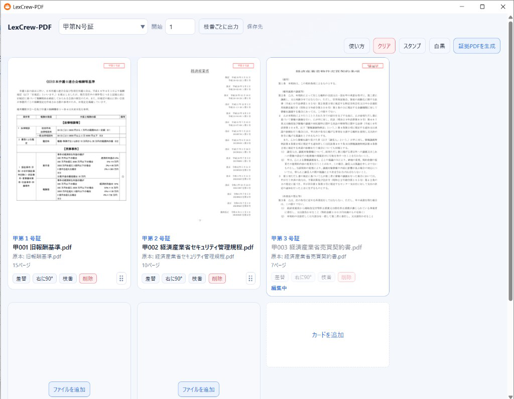
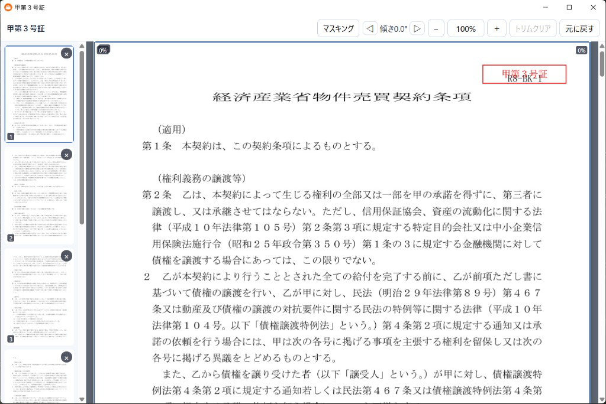

# LexCrew-PDF

カードへ PDF または JPG、PNG を置き、印付きの A4 をこの PC のダウンロードフォルダの「LexCrew-PDF-Downloads」へ書く Windows デスクトップアプリです。事件データベースは持ちません。生成先のフォルダは選べません。

開発者: 弁護士　吉田秀平

## 画面

カードへ PDF または画像を置くと、先頭ページに証拠番号が付きます。



ページを開くと、並べ替え、マスキング、トリム、傾きができます。印は出す PDF の1ページ目に付きます。色、大きさ、フォントはヘッダーの「スタンプ」で変えます。色は赤、青、緑、黒です。



## できること

### カード

- 起動すると、ダウンロードフォルダの「LexCrew-PDF-Downloads」に保存済みのカードがあればそれを出す。無ければ甲第１号証から甲第６号証までの空のカードが6枚出る
- 以前の「証拠」または「LexCrew-PDF」が出力フォルダだけのときは、「LexCrew-PDF-Downloads」に改名してから読む。アプリ本体のフォルダは改名しない
- 「カードを追加」で次の番号を足す。「削除」でそのカードを消すと、後ろの証拠番号が詰まる
- ヘッダーで「甲第N号証」「乙第N号証」「丙第N号証」「疎甲第N号証」「疎乙第N号証」「疎丙第N号証」「別紙N」「資料N」を選ぶ。欄には `乙A第N号証` のように、甲乙丙丁戊のあとに英字1字を書いた形も入れられる。`資料N` ならカードは資料１、資料２…、ファイル名は `資料001 ` になる。疎甲第N号証の枝番は `疎甲001-1 ` になる。乙A第N号証のファイル名は `乙A001 ` になる
- ヘッダーの「開始」は先頭カードの証拠番号で、初期値は1です。7なら甲第７号証から始まり、ファイル名は `甲007 書名.pdf` です
- カード右下のつまみで順番を変えると、証拠番号、印、ファイル名が付いて変わる

### 枝番

- 「枝番」で、の１、の２がそれぞれ別のカードになる。ページの入っていない枝番は PDF を出さない
- 枝番を消すと、残った枝番の番号が詰まる
- 枝番を番号の外へ動かすと枝番なしになる。枝番なしのカードは枝番に入らない
- 枝番のカードは分かれます。サムネイル、順番、マスキング、回転は枝番ごとです。まとめるのは証拠 PDF を書くときだけです
- 枝番が2つ以上ある号証は、初期状態で1つの PDF にします。ファイル名は `甲001-1~3 書名.pdf` のように、入っている最初の枝番から最後の枝番までを `~` でつなぎます。書名は最初の枝番の書名です。親カードのファイル名欄で直せます。各枝番のカードに `→ 甲001-1~3 に含めて出力` と出ます。各枝番の先頭ページに、その枝番の印（`甲第１号証の１` など）を押します。ヘッダーの「枝番ごとに出力」を押すと、この案件の枝番はすべて別の PDF になります。設定の無い古い配置も、まとめて出します
- 間の枝番に PDF が無いときは、`甲001-1~3` のようにはまとめません。カードに「PDFが無いため、まとめて出力しません」と出して、枝番ごとに書きます。空の枝番を削除すると番号が詰まり、そのあとまとまります。画面では枝番の最後の1ページを外せないので、出すページが全部無くなることはありません。配置ファイルで出すページを空にした場合も、印の番号は付け替えず、まとめずに案内します

### ページ

- 「ファイルを追加」は、まだファイルの無いカードの中央にだけ出る。ファイルがあるカードは「差替」と「右に90°」で扱う。サムネイルへ別のファイルをドロップしても差替になる
- 置けるのは PDF、JPG、JPEG、PNG。カードへドロップする、ファイルを選ぶ、「差替」、「ファイルを追加」のどれでも同じ。HEIC には対応せず、そのときは画面に案内を出す
- 画像は1枚が1ページになる。EXIF の向きを反映してから、縦の A4 に収める。元の画素より大きくはせず、小さい画像は中央に置く。横長の A4 か A3 に近い画像は、その横の用紙のままにするので、見開きの「分割」も使える。そのあとマスキング、トリム、回転、印、枝番は PDF と同じ
- 一度に複数のファイルを置いたときは、PDF を複数置いたときと同じで、置いた順に原本が並ぶ。画像もその順にページになる
- サムネイルは、そのカードの出すページの先頭で、右肩に証拠番号の印が付く。クリックすると編集ウィンドウが開く
- ヘッダーの「スタンプ」で印の色、大きさ、フォントを変える。色は赤、青、緑、黒。フォントは明朝とゴシック。大きさは 8 から 24 ポイント。初期値は赤、11 ポイント、明朝。案件の印はすべて同じ見た目になる
- 左に出すページが縦に並び、ドラッグで順番を変え、右肩の X でそのページを外す。右はその並びをスクロールして見る。最後の1枚は外せない
- 「マスキング」でページ上をドラッグすると、その範囲を黒く覆える。右上の X で外せる。生成した PDF では、その範囲の文字と画像は戻らない
- 見ているページの画像の四辺をドラッグすると、その端を 1% 刻みで最大 40% まで削れる。中身は拡大せず、同じ位置に残る。「トリムクリア」でそのページの削りを戻す
- ヘッダーの ◁ ▷ で、見ているページを 0.1 度ずつ、左右に最大 10 度まで傾けられる。押し続けているあいだは画面上だけが回り、離すと保存される。証拠番号の印は回らない。傾きの表示をダブルクリックすると 0 度に戻る
- 「元に戻す」は、その枝番のページ順を原本に戻す。削りと傾きは残る。分割の切り替えでは傾きが消える。分割した左右は同じ角度になる
- 編集中の証拠番号は、メインのカードで差替、回転、削除ができない。枝番なら、その枝番の番号が付く

### 生成と保存

- 「証拠PDFを生成」で、ダウンロードフォルダの「LexCrew-PDF-Downloads」に印付き PDF を書く。1件以上書けたときは、そのフォルダをエクスプローラーで開く。生成中はボタンを押せない。画面の右上に保存先のパスが出る
- 出力 PDF の名前は `甲001 書名.pdf` です。番号と書名のあいだは半角スペースです。枝番があるときは `甲001-1 書名.pdf` です。印は `甲第１号証`、枝番の印は `甲第１号証の１` です。疎甲第N号証は `疎甲001 書名.pdf`、枝番は `疎甲001-1 書名.pdf` です。別紙N は `別紙001 `、資料N は `資料001 ` です。乙A第N号証は `乙A001 書名.pdf` です
- ファイル名は `.pdf` を含めて 100 文字までです。番号と半角スペースは残し、超えた書名は後ろを切ります。切れ端の空白とピリオドは残しません
- 書名が空のときは、そのカードの最初の原本の拡張子を除いた名前を使う。PDF でも JPG、PNG でも同じ。先頭に `甲1 `、`甲第2号証_`、`乙3の1 `、`甲001-1~3 ` のような号証番号があるときは、それを除いてから書名にする。手入力した書名は除かない
- カードを変えるたびに `LexCrew-PDF-Downloads\layout.json` を上書きする。アプリのフォルダには案件データを書かない
- 消すのは、前回このアプリが書いた名前のうち、今回残さないものだけです。`メモ.pdf` のように自分で置いたファイルは残す。原本はコピーしない。画像も、置いた場所のファイルをそのまま読む
- ヘッダーの「頁番号」を押すと設定が開く。付ける、色、大きさ、フォント、位置（左下、中央下、右下）、パターン（n/N、n）を選べる。初期状態では付かない。見た目の初期値は黒、8 ポイント、明朝、中央下、n/N で、印とは別に `layout.json` へ残る。付けたとき、2ページ以上の枝番なら下端に `1 / 15` または `1` と出る。カードのサムネイルと編集画面にも、同じ番号が出る。1ページの枝番には付けない。番号は枝番ごとに 1 から振り直す。枝番を1つの PDF にまとめても、の１との２は別々に数える
- 生成した PDF の文書情報は空にする。タイトル、作成者、件名、キーワード、作成と更新の日時、XMP、添付ファイル、注釈、JavaScript は残さない

対象は PDF、JPG、PNG です。HEIC には対応していません。

## 動作のイメージ

```text
起動.bat
  └─ python -m lexcrew_pdf
       ├─ ダウンロードフォルダの layout.json を読む。PDF は開かない
       └─ pywebview + WebView2
            ui/          カードとページ編集
                 │
                 ▼
            Session      カードの状態。保存先はダウンロードフォルダ
                 │
                 ▼
            stamp.py     A4、印、回転、マスキング、トリム
                 │
                 ▼
            write.py     LexCrew-PDF-Downloads へ書き、前回分だけ消す
```

- Python と画面は1つのプロセスです。ページは pywebview の `js_api` で Python を直接呼びます
- HTTP サーバは立てません。Chromium も同梱しません。描画はシステムの WebView2 です
- PDF の読み書きは PyMuPDF です。明朝の印は游明朝、ゴシックの印は游ゴシックを埋め込みます

## 動作環境

- **OS** — Windows 64bit
- **WebView2** — システムの Edge WebView2 ランタイム
- **游明朝** — `C:\Windows\Fonts\yumin.ttf`。初期の印に使う。無いときは、明朝のままでは PDF を書かず、前回のファイルも消しません
- **游ゴシック** — `C:\Windows\Fonts\YuGothM.ttc`。ゴシックを選んだときに使う。無いときはその設定を保存せず、生成もしません
- **配布物** — Python は zip に同梱します。相手の PC に Python は要りません

## インストール（利用者向け）

1. 配布物の `LexCrew-PDF-1.2.0-win64.zip` を全部展開します。zip の中のファイルを直接開かないでください
2. 展開したフォルダは、ドキュメントやデスクトップなど、書き込める場所に置きます。Program Files には置かないでください
3. `LexCrew-PDF.bat` を一度実行します。デスクトップに朱色のアイコンが出て、アプリも開きます
4. 次回からは、そのアイコンをクリックして起動します
5. フォルダを移動したあとは、もう一度 `LexCrew-PDF.bat` を実行すると、アイコンのリンク先が新しい場所になります

止めるときは `停止.bat` を使います。

証拠 PDF とカードの配置は、この PC のダウンロードフォルダの「LexCrew-PDF-Downloads」に保存されます。ダウンロードフォルダを別の場所へ移していても、Windows が示しているその場所を使います。

## 開発者向け

このフォルダで開発します。配布物の `LexCrew-PDF.bat` とは別に、開発用の `起動.bat` と `停止.bat` があります。

`起動.bat` は、同じ仮想環境で既に動いているときはもう1つ開きません。`停止.bat` が止めるのは、このフォルダの `.venv` で動いている `lexcrew_pdf` だけです。起動ログの最初の行は `cards-ready` です。この行より前に PDF は開きません。

### 必要なもの

- Python 3.11 以上
- WebView2 ランタイム
- 游明朝 `C:\Windows\Fonts\yumin.ttf`
- ゴシックの印を使うときは游ゴシック `C:\Windows\Fonts\YuGothM.ttc`

### コマンド

```powershell
py -3 -m venv .venv
.\.venv\Scripts\python.exe -m pip install -e .
.\.venv\Scripts\python.exe -m lexcrew_pdf
.\.venv\Scripts\python.exe -m pytest
powershell -ExecutionPolicy Bypass -File packaging\build.ps1
```

`-e` を付けると、`python -m lexcrew_pdf` が `src` のコードを直接読みます。`packaging\build.ps1` は `dist\LexCrew-PDF-1.2.0-win64.zip` を作ります。初回は埋め込みの Python を取得するため、インターネットが必要です。

### 主なディレクトリ

| パス | 内容 |
|------|------|
| `src/lexcrew_pdf/__main__.py` | `python -m lexcrew_pdf` の入口 |
| `src/lexcrew_pdf/window.py` | 窓と、エクスプローラからのドロップ |
| `src/lexcrew_pdf/session.py` | 画面が使う操作。起動時の表示は配置だけで、PDF を開かない |
| `src/lexcrew_pdf/layout.py` | カード、スロット、ページ順、`layout.json` |
| `src/lexcrew_pdf/names.py` | 甲乙丙、乙A、印の文字、出力ファイル名、100文字、号証番号の除去 |
| `src/lexcrew_pdf/pages.py` | 除外、本体、枝番グループ。本体が空の指定は原本順に戻す |
| `src/lexcrew_pdf/plan.py` | カードから、印字へ渡すジョブを作る。枝番は1つの PDF にもまとめられる |
| `src/lexcrew_pdf/stamp.py` | 原本を A4 縦へ載せ、出力の1ページ目、または各枝番の先頭ページだけ印を押す。画像はここで A4 の1ページにし、頁番号と文書情報の消去もここで行う |
| `src/lexcrew_pdf/write.py` | `名前.pdf.writing` に書いてから置き換える |
| `ui/` | カード画面とページ編集。ビルド工程は無い |
| `packaging/build.ps1` | 配布用 zip を作る |

`layout.json` に入れるものは、カード、書名、回転、分割、ファイルの場所、ページ順、前回書いたファイル名、初期値と違う印の色と大きさとフォント、枝番を分けて出す設定、1以外の開始番号、頁番号の設定です。回転 0、分割オフ、原本順のページ、初期値の印、枝番をまとめる初期値、開始番号1、頁番号の初期値（オフ、黒、8 ポイント、明朝、中央下、n/N）は省略します。枝番ごとに出すときは `mergeBranches` を `false` にします。開始番号は `firstNumber` です。頁番号を初期値から変えたときは `pageNumbers` に、付けるか、色、大きさ、フォント、位置、パターンを書きます。以前の `pageNumbers: true` は、付けるだけでほかは初期値として読みます。フォルダの中の原本は相対パス、外の原本は絶対パスです。以前の `filenameSeparator` は読み飛ばし、次の保存で消えます。

## 注意

- 生成した PDF は、証拠番号を押して A4 に整えたファイルです。マスキングした範囲の文字と画像は戻せません。
- 選んだ印のフォントが無いときは PDF を書かず、前回のファイルも消しません。
- このリポジトリを手元で動かしただけでは、デスクトップの配布用アイコンは出ません。アイコンが要るときは `packaging\build.ps1` で作った zip を展開し、`LexCrew-PDF.bat` を実行してください。

## ライセンス

LexCrew-PDF のソースと配布 zip は、GNU AGPL 3.0 で提供します。Copyright (C) 2026 吉田秀平。全文は [LICENSE](LICENSE) です。

同梱の PyMuPDF は GNU AGPL 3.0 です。この配布物では改変していません。ソースは [PyMuPDF](https://github.com/pymupdf/PyMuPDF) の、zip に入っている版です。Artifex の商用ライセンスは含みません。

pywebview は BSD 3-Clause License です。Copyright (c) 2014-2017, Roman Sirokov。原文は配布 zip の pywebview の dist-info にあります。

開発: 弁護士　吉田秀平
